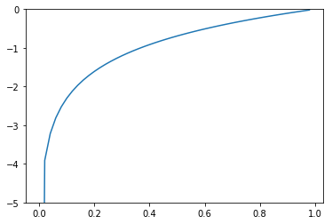

# 4장 신경망 학습

## 4.1 데이터에서 학습한다!

앞장에서는 사람이 가중치와 편향을 정해주고 실현했는데 이번장에는 컴퓨터가 데이터를 보고 자동으로 매개변수의 최적값을 결정합니다. nice! 

최종목표는 1이면 1밖에 모르는 고지식한 컴퓨터를 독립시켜라!

그럼 어떻게?

### 4.1.1 데이터 주도 학습

기계학습은 데이터가 생명입니다. 기계학습 중심에는 데이터가 존재합니다.

모든 문제는 어떠한 특징에 따라 사람들은 문제를 해결해 나갑니다. 전엔 기계도 그런 특징을 배워주고 문제를 해결했는데 인젠 기계가 그런 특징을 스스로 학습하는것입니다. 

### 4.1.2 훈련 데이터와 시험 데이터

훈련 데이터로 훈련시켜 최적의 매개변수를 찾고 시험 데이터로 앞에서 훈련한 모델의 실력을 평가합니다. 그래서 나중에 처음보는 데이터라도 정확히 잘 판별할수있는 능력 즉 범용(泛用) 능력을 획득하는것이 가장 큰 과제입니다.

## 4.2 손실 함수

신경망 학습에서 현재 상태를 하나의 지표로 표현하는데 신경망 학습에서 사용하는 지표는 손실 함수라고 합니다. 

궁극적으로 손실함수값을 될수록 작게 만들어주는 가중치의 매개변수를 찾는 것이 가장 중요한 목적입니다.

### 4.2.1 평균 제곱 오차

공식: $E = 1/2 \sum_k(y_k - t_k)^2$

함수 구현


```python
import numpy as np
def mean_squared_error(y, t):
    return 0.5*np.sum((y-t)**2)
#정답은 '2'
t = [0, 0, 1, 0, 0, 0, 0, 0, 0, 0]

# 예1: '2'의 확률이 가장 높다고 추정함(0.6)
y = [0.1, 0.05, 0.6, 0.0, 0.05, 0.1, 0.0, 0.1, 0.0, 0.0]
mean_squared_error(np.array(y), np.array(t))
```


    0.097500000000000031


```python
# 예2: '7'일 확률이 가장 높다고 추정함(0.6)
y = [0.1, 0.05, 0.1, 0.0, 0.05, 0.1, 0.0, 0.6, 0.0, 0.0]
mean_squared_error(np.array(y), np.array(t))
```


    0.59750000000000003


보다싶이 정답이 2일때 출력도 2일때 손실함수(평균 제곱 오차)의 값이 작고 정답이 2인데 출력이 7일때 손실함수의 값이 크기때문에 예1의 결과가 정답에 더 가까운것으로 판단할수 있습니다.

### 4.2.2 교차 엔트로피 오차

공식: $ E = -\sum_kt_klogy_k$

y = logx의 그라프


```python
import numpy as np
import matplotlib.pylab as plt
x = np.arange(1e-10, 1.0, 0.02)
y = np.log(x)
plt.plot(x,y)
plt.ylim(-5.0, 0.0)
plt.show()
```





보다싶이 x가 1일때 y는 0이되고 x가 0에 가까워 질수록 y의 값은 점점 작아집니다. 때문에 앞에 - 를 붙이면 정답일때의 출력이 커질수록 0에 가까워지고 1일때 0이 됩니다. 반대로 정답일때의 출력이 작아질수록 오차는 커집니다. 


```python
def cross_entropy_error(y,t):
    delta = 1e-7
    return -np.sum(t * np.log(y + delta))
t = [0, 0, 1, 0, 0, 0, 0, 0, 0, 0]
y = [0.1, 0.05, 0.6, 0.0, 0.05, 0.1, 0.0, 0.1, 0.0, 0.0]
cross_entropy_error(np.array(y), np.array(t))
```


    0.51082545709933802


```python
y = [0.1, 0.05, 0.1, 0.0, 0.05, 0.1, 0.0, 0.6, 0.0, 0.0]
cross_entropy_error(np.array(y), np.array(t))
```


    2.3025840929945458


여기서도 첫번째 예의 손실함수(교차 엔트로피 오차)의 값이 작으므로 정답에 가깝습니다. 평균 제곱 오차와 같은 결과입니다.

### 4.2.3 미니배치 학습

앞에서 데이터 하나에 대한 손실함수를 생각했으니 훈련데이터 N개로는 N개의 손실함수의 합을 N등분하여 정규화시켜 평균 손실함수를 구하여 그것을 지표로 사용할수 있습니다. 그러면 데이터 개수와 관계없이 평균손실함수를 구할수 있습니다. 
그런데 훈련데이터가 너무 많으면....시간이 너무 오래걸려 효률이 낮겠죠. 그래서 그 많은 훈련데이터중 일부만 골라서 학습하는데 이 일부를 미니배치라고 합니다. 그리고 그것을 훈련하고 학습하는 방법을 미니배치 학습이라고 합니다.

공식: $E = -1/N\sum_n\sum_kt_{nk}logy_{nk}$
